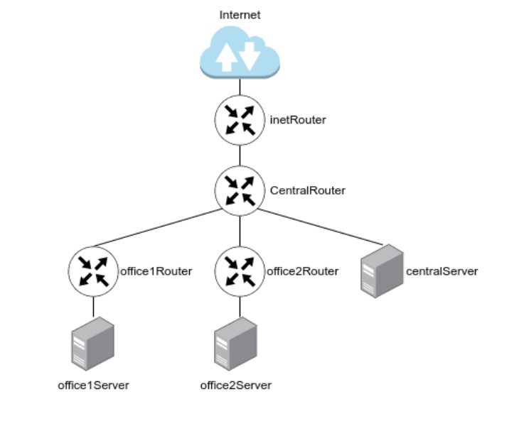

# Проектная работа
-------------------------------------------------

## Тема: GLPI для ITSM: автоматическое развертывание с прокси, балансировкой и мониторингом.

### Цель домашнего задания

Научится менять базовые сетевые настройки в Linux-based системах.

### Описание домашнего задания

  1. Скачать и развернуть Vagrant-стенд https://github.com/erlong15/otus-linux/tree/network
  2. Построить следующую сетевую архитектуру:

Таблица инфраструктуры:

| Сервер | IP адрес | Сервис |
|---|---|---|
| Otussrv0 | 192.168.50.10/24 | NGINX |
| Otussrv1 | 192.168.50.11/24 | GLPI, Apache2 |
| Otussrv2 | 192.168.50.12/24 | GLPI, Apache2 |
| Otussrv3 | 192.168.50.13/24 | Myssql - Master |
| Otussrv4 | 192.168.50.14/24 | Myssql - Slave |
| Otussrv5 | 192.168.50.15/24 | Zabbix |
| Otussrv6 | 192.168.50.16/24 | Elasticsearch |





### Формат сдачи: 

- Задание состоит из 2-х частей: теоретической и практической.

В теоретической части требуется: 
  - Найти свободные подсети
  - Посчитать количество узлов в каждой подсети, включая свободные 
  - Указать Broadcast-адрес для каждой подсети
  - Проверить, нет ли ошибок при разбиении

В практической части требуется: 
  - Соединить офисы в сеть согласно логической схеме и настроить роутинг
  - Интернет-трафик со всех серверов должен ходить через inetRouter
  - Все сервера должны видеть друг друга (должен проходить ping)
  - У всех новых серверов отключить дефолт на NAT (eth0), который vagrant поднимает для связи
  - Добавить дополнительные сетевые интерфейсы, если потребуется

Рекомендуется использовать Vagrant + Ansible для настройки данной схемы.

### Выполнение доманей работы

Таблица топологии

| Название | Сеть | Маска | Кол-во адресов | Первый адрес | Последний адрес | Broadcast |
| --- | --- | --- | --- | --- | --- | --- |
|Central Networl |
| Directors | 192.168.0.0/28 | 255.255.255.240 | 14 | 192.168.0.1 | 192.168.0.14 | 192.168.0.15 |
| Office hardware| 192.168.0.32/28 | 255.255.255.240 | 14 | 192.168.0.1 | 192.168.0.14 | 192.168.0.15 |
| WiFi (mgt Network) | 192.168.0.64/26 | 255.255.255.240 | 14 | 192.168.0.1 | 192.168.0.14 | 192.168.0.15 |
| --- | --- | --- | --- | --- | --- | --- |
|Office 1 network |
| Dev | 192.168.2.0/26 | 255.255.255.192 | 62 | 192.168.2.1 | 192.168.2.62 | 192.168.2.63 |
| Test | 192.168.2.64/26 | 255.255.255.192 | 62 | 192.168.2.65 | 192.168.2.126 | 192.168.2.127 |
| managers | 192.168.2.128/26 | 255.255.255.192 | 62 | 192.168.2.129 | 192.168.2.190 | 192.168.2.191 |
| office hardware | 192.168.2.192/26 | 255.255.255.192 | 62 | 192.168.2.193 | 192.168.2.254 | 192.168.2.255|
| --- | --- | --- | --- | --- | --- | --- |
|Office 2 network |
| --- | --- | --- | --- | --- | --- | --- |
| Dev| 192.168.1.0/25 | 255.255.255.128 | 126 | 192.168.1.1 | 192.168.1.2 | 192.168.1.127 |
| Test| 192.168.1.128/26 | 255.255.255.192 | 62 | 192.168.1.129 | 192.168.1.130 | 192.168.1.191 |
| Office | 192.168.1.192/26 | 255.255.255.192 | 62 | 192.168.1.193 | 192.168.1.254 | 192.168.1.255 |
| --- | --- | --- | --- | --- | --- | --- |
|Inet Router - CentralRouter network                                                    |
| --- | --- | --- | --- | --- | --- | --- |
| Inet Central | 192.168.255.0/30 | 255.255.255.252 | 2 | 192.168.255.1 | 192.168.255.2 | 192.168.255.3 |


Свободные ip
  - 192.168.0.16/28 
  - 192.168.0.48/28
  - 192.168.0.128/25
  - 192.168.255.64/26
  - 192.168.255.32/27
  - 192.168.255.16/28
  - 192.168.255.8/29  
  - 192.168.255.4/30 


Изучив таблицу топологии сети и Vagrant-стенд из задания, мы можем построить полную схему сети:


На основании этой схемы мы получаем готовый список серверов.
| Server | IP and Bitmask |
| --- | --- |
| inetRouter | Default-NAT address VirtualBox |
|            | 192.168.255.1/30 |
| centralRouter | 192.168.255.2/30 |
|               | 192.168.0.1/28 |
|               | 192.168.0.33/28 |
|               | 192.168.0.65/26 |
|               | 192.168.255.9/30 |
|               | 192.168.255.5/30 |
| centralServer | 192.168.0.2/28 |
| office1Router | 192.168.255.10/30 |
|               | 192.168.2.1/26 |
|               | 192.168.2.65/26 |
|               | 192.168.2.129/26 |
|               | 192.168.2.193/26 |
| office1Server | 192.168.2.130/26 |
| office2Router | 192.168.255.6/30 |
|               | 192.168.1.1/26 |
|               | 192.168.1.129/26 |
|               | 192.168.1.193/26 |
| office2Server | 192.168.1.2/26 |


Развернем Vagrant-стенд:
  - Создайте папку с проектом и зайдите в нее (например: /otus_backup):
```
mkdir -p otus_backup ; cd ./otus_backup
```
  - Клонируете проект с Github, набрав команду:
```
apt update -y && apt install git -y ; git clone https://github.com/pahami/otus_backup.git
```
  - Запустите проект из папки, в которую склонировали проект (в нашем примере ./otus_backup):

```
vagrant up
```

Для проверки можете попробовать подключиться к хосту по ssh

```borg list borg@192.168.11.160:/var/backup/```

<details>
<summary> Результат </summary>

```
vagrant@client:~$ borg list borg@192.168.56.10:/var/backup/
borg@192.168.56.10's password: 
Enter passphrase for key ssh://borg@192.168.56.10/var/backup: 
etc-2025-02-23_19:28:39              Sun, 2025-02-23 19:28:40 [4542de5de86caee43fc62d0919fb67f963eb29151dc6e1c2fd0d4cda56fae114]
etc-2025-02-23_20:01:05              Sun, 2025-02-23 20:01:06 [f2ec4629ac31ffb52bc408b450140f56222a099b5dffe0c93dfa9717ca749ae7]
```
</details>

Посмотреть логи:


```
vagrant ssh srv
ll /var/log/rsyslog/client/
```

<details>
<summary> Результат </summary>

```
vagrant@srv:~$ ll /var/log/rsyslog/client/
total 52
drwxr-xr-x 2 syslog syslog  4096 Feb 23 19:32 ./
drwxr-xr-x 4 syslog syslog  4096 Feb 23 19:28 ../
-rw-r----- 1 syslog adm      355 Feb 23 19:32 dbus-daemon.log
-rw-r----- 1 syslog adm     3179 Feb 23 19:28 python3.log
-rw-r----- 1 syslog adm      546 Feb 23 19:28 rsyslogd.log
-rw-r----- 1 syslog adm     1276 Feb 23 19:58 sshd.log
-rw-r----- 1 syslog adm    12232 Feb 23 20:07 sshpass.log
-rw-r----- 1 syslog adm     4776 Feb 23 19:28 sudo.log
-rw-r----- 1 syslog adm      567 Feb 23 19:58 systemd-logind.log
-rw-r----- 1 syslog adm     3730 Feb 23 20:07 systemd.log

```
</details>