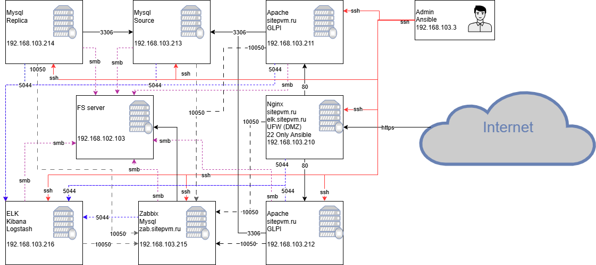

# Проектная работа
-------------------------------------------------

## Тема: GLPI для ITSM: автоматическое развертывание с прокси, балансировкой и мониторингом.

### Схема проекта



Для работы стенда необходимо заранее подготовить серверы или воспользоваться шаблоном Vagrantfile. 

Таблица инфраструктуры:

| Сервер | IP адрес | Сервис |
|---|---|---|
| Otussrv0 | 192.168.103.210/24 | NGINX |
| Otussrv1 | 192.168.103.211/24 | GLPI, Apache2 |
| Otussrv2 | 192.168.103.212/24 | GLPI, Apache2 |
| Otussrv3 | 192.168.103.213/24 | Myssql - Master |
| Otussrv4 | 192.168.103.214/24 | Myssql - Slave |
| Otussrv5 | 192.168.103.215/24 | Zabbix |
| Otussrv6 | 192.168.103.216/24 | Elasticsearch |
| Otusstart| 192.168.103.3/24 | Ansible |

Доступ по ssh только из Ansible


### Формат сдачи: 


Развернем Vagrant-стенд:
  - Создайте папку с проектом и зайдите в нее (например: /otus_backup):
```
mkdir -p otus_backup ; cd ./otus_backup
```
  - Клонируете проект с Github, набрав команду:
```
apt update -y && apt install git -y ; git clone https://github.com/pahami/otus_backup.git
```
  - Запустите проект из папки, в которую склонировали проект (в нашем примере ./otus_backup):

```
vagrant up
```

Для проверки можете попробовать подключиться к хосту по ssh

```borg list borg@192.168.11.160:/var/backup/```

<details>
<summary> Результат </summary>

```
vagrant@client:~$ borg list borg@192.168.56.10:/var/backup/
borg@192.168.56.10's password: 
Enter passphrase for key ssh://borg@192.168.56.10/var/backup: 
etc-2025-02-23_19:28:39              Sun, 2025-02-23 19:28:40 [4542de5de86caee43fc62d0919fb67f963eb29151dc6e1c2fd0d4cda56fae114]
etc-2025-02-23_20:01:05              Sun, 2025-02-23 20:01:06 [f2ec4629ac31ffb52bc408b450140f56222a099b5dffe0c93dfa9717ca749ae7]
```
</details>

Посмотреть логи:


```
vagrant ssh srv
ll /var/log/rsyslog/client/
```

<details>
<summary> Результат </summary>

```
vagrant@srv:~$ ll /var/log/rsyslog/client/
total 52
drwxr-xr-x 2 syslog syslog  4096 Feb 23 19:32 ./
drwxr-xr-x 4 syslog syslog  4096 Feb 23 19:28 ../
-rw-r----- 1 syslog adm      355 Feb 23 19:32 dbus-daemon.log
-rw-r----- 1 syslog adm     3179 Feb 23 19:28 python3.log
-rw-r----- 1 syslog adm      546 Feb 23 19:28 rsyslogd.log
-rw-r----- 1 syslog adm     1276 Feb 23 19:58 sshd.log
-rw-r----- 1 syslog adm    12232 Feb 23 20:07 sshpass.log
-rw-r----- 1 syslog adm     4776 Feb 23 19:28 sudo.log
-rw-r----- 1 syslog adm      567 Feb 23 19:58 systemd-logind.log
-rw-r----- 1 syslog adm     3730 Feb 23 20:07 systemd.log

```
</details>
